<p align="center">
  <a href="https://github.com/ATXLtheAxolotl/VidereLonge">
    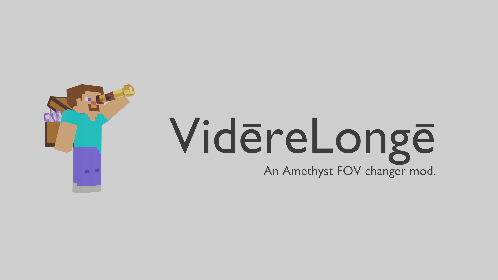
  </a>

  <p align="center">
    <a href="https://github.com/ATXLtheAxolotl/VidereLonge">Github</a>
    ·
    <a href="https://github.com/ATXLtheAxolotl/VidereLonge/issues/new">Report An Issue</a>
    ·
    <a href="https://github.com/ATXLtheAxolotl/VidereLonge/issues/new">Request A Feature</a>
  </p>
</p>

<div align="center">

  [](https://github.com/ATXLtheAxolotl/VidereLonge/graphs/contributors)
  [](https://github.com/ATXLtheAxolotl/VidereLonge/network/members)
  [](https://github.com/ATXLtheAxolotl/VidereLonge/stargazers)
  [](https://github.com/ATXLtheAxolotl/VidereLonge/issues)
  [](https://github.com/ATXLtheAxolotl/VidereLonge/blob/main/License.md)
</div>

## VidēreLongē v1.3.0
Currently stable on Minecraft Bedrock Edition 1.21.0.3 with Amethyst Runtime 1.3.0

<video controls>
    <source src="./assets/VidereLongeExample.mp4" type="video/mp4">
</video>

## How do I run this?
1. Ensure you have developer mode  enabled on Windows, if you don't know how see [this tutorial](https://consumer.huawei.com/en/support/content/en-us15594140/#:~:text=Click%20the%20Windows%20icon%20and,Mode%20in%20certain%20system%20versions).

2. Download, play, and close Minecraft Bedrock 1.21.0.3

3. Find and install the latest Amethyst [Launcher](https://github.com/FrederoxDev/Amethyst-Launcher/releases/latest) and [Runtime](https://github.com/FrederoxDev/Amethyst/releases/latest) release Amethyst's releases page.

4. Go to the mod manager menu and click the `Open Mods Folder` button.

    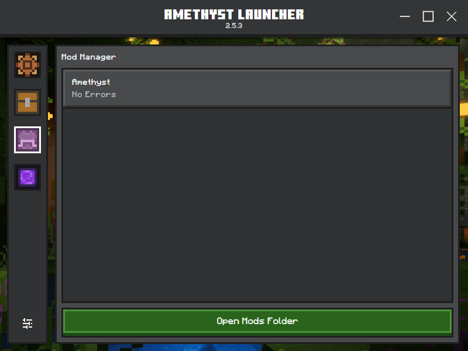

5. Download the latest [ViderēLongē release](https://github.com/ATXLtheAxolotl/VidereLonge/releases/latest).

6. Bring the AmethystRuntime and ViderēLongē zip files to your mods folder like this:

    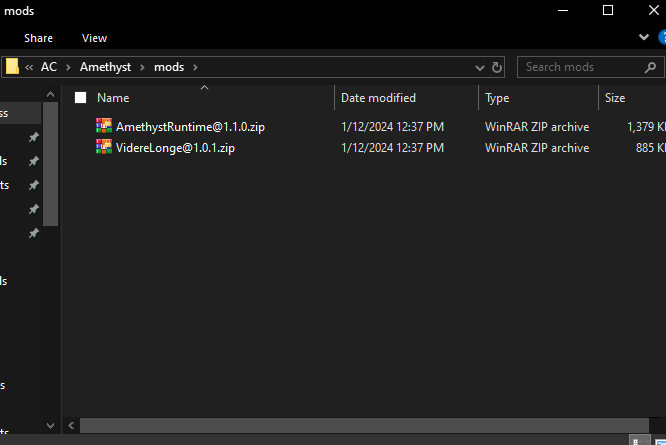

7. Extract both zip files, the structure should look like the following.

    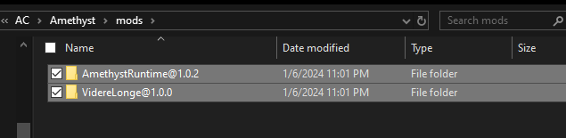

8. Go back to Amethyst Launcher, reload the page with `Ctrl + R`, then go to the profile editor page.

9. Create or use your existing mod profile.

    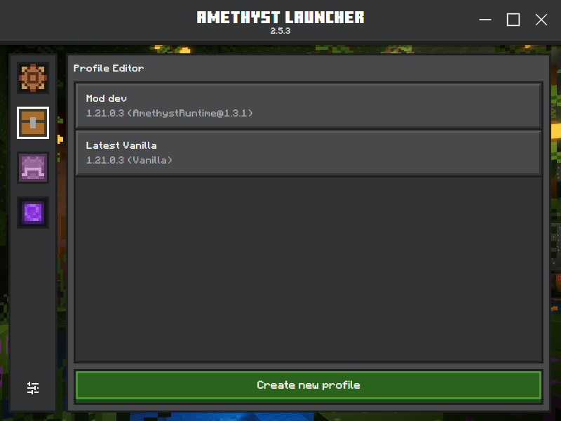

10. Select the latest runtime that you downloaded, and click ViderēLongē from the `Inactive Mods` list to bring it over to the active mods. After that, press `Save Profile`.

    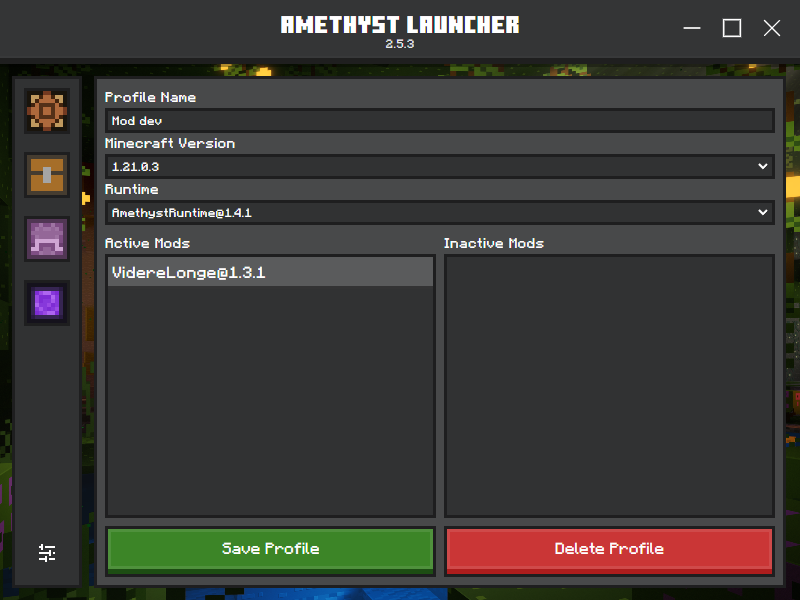

11. Launch the game, and have fun!

    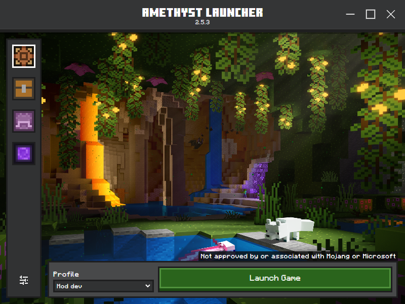


## My game is crashing when I launch? What do I do?

Join the [Amethyst modding Discord guild](https://discord.gg/DcCksKssfD), we'll be happy to help (just don't spam ping us ;) )!

## How do I change the zoom keybind?
1. Go to your settings

    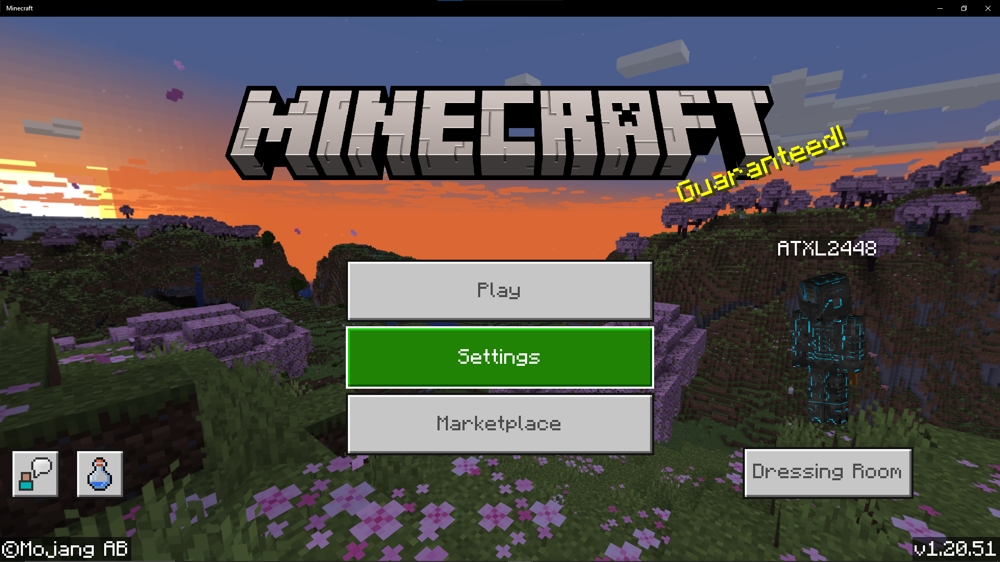

2. Click `Keyboard & Mouse`

    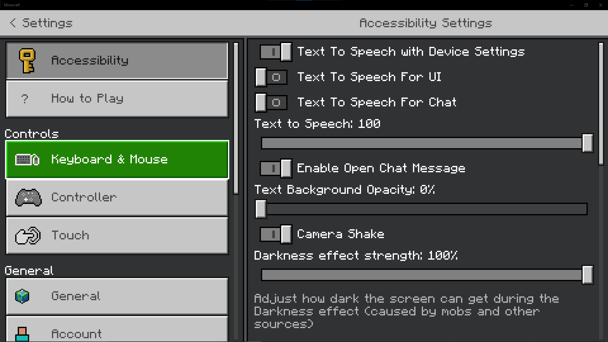

3. Scroll until you find `key.zoom`, then bind it to the desired key.

    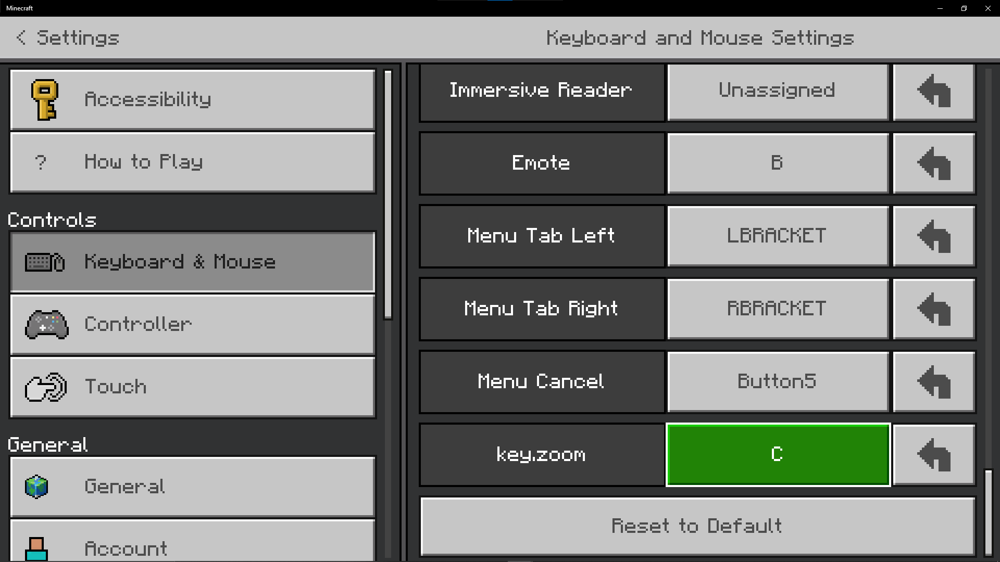

## How do I change the config?
1.  Open the mods folder.

    

2. Find the VidēreLongē folder.
    
    

3. Open `config.json` and change it to whatever you please.

    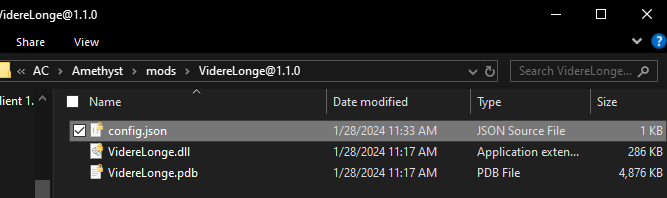

> **Note**
> A default config.json should be made automatically once you start the game however you can still manually make it if you like.
> ````json
> {
>   "zoomType": "gradual",
>   "sensitivityDampen": 90.0,
>   "targetFov": 10.0,
>   "duration": 0.2
> }
> ````

4. The config format is the following:
    * `zoomType` can either be `instant` or `gradual`. Instant sets your FOV to the `targetFov` the *intstant* you press the zoom key and `gradual` zooms in slowly.
    * `sensitivityDampen` is the percentage you want your sensitivity to decrease by when zoomed.
    * `targetFov` is the FOV the mod will stop at when you press the zoom key.
    * `duration` is for the `gradual` mode. In this amount of time (seconds) you will reach the `targetFov`.

## How was the banner made?
* This was made with Blender using two assets from Sketchfab.
* [Construction Steve](https://sketchfab.com/3d-models/construction-steve-41f6a232772c4b069eab765ef96a0ec1) by [Ghost99](https://sketchfab.com/Ghost99) using the [CC By 4.0 Deed License](https://creativecommons.org/licenses/by/4.0/). This work was modified.
* [Spyglass](https://sketchfab.com/3d-models/spyglass-d1c88de81f594dc79786f16d497fd908) by [Azumiru](https://sketchfab.com/Azumiru) using the [CC By 4.0 Deed License](https://creativecommons.org/licenses/by/4.0/).
